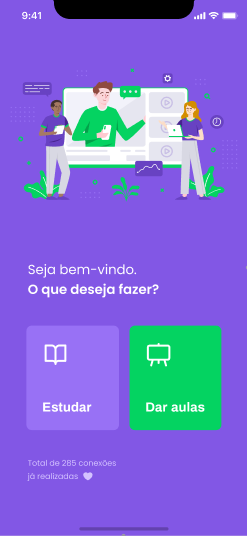
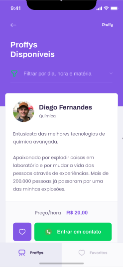
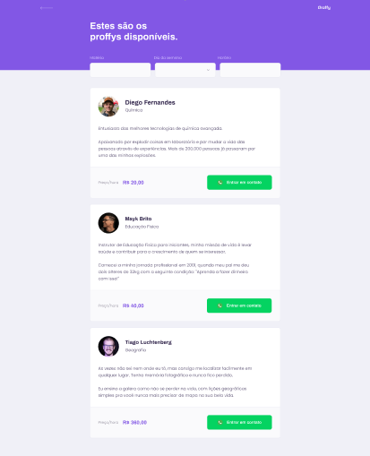
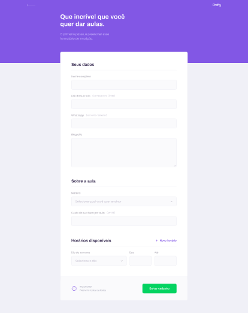

<h1 align="center">
    
</h1>

<h1 align="center">Proffy</h1>
<h2 align="center">Sua plataforma de estudos online</h2>

## 💻 Sobre o Projeto

 💻🧑‍ Proffy - é uma forma de você estudar ou dar aulas à distância

 Instrutores interessados em dar aulas pela plataforma poderão se cadastrar na plataforma enviando:

- Nome completo
- Link da sua foto
- Número de contato (WhatsApp)
- Biografia
- Matéria que ensinará
- Custo da hora/aula
- Horários disponíveis com os dias da semana

Os usuários terão acesso também ao aplicativo móvel, onde poderão ter mais comodidade para ter acesso ao conteúdo a qualquer momento.

Projeto desenvolvido durante a NLW - Next Level Week 2 promovida pela <a href="https://rocketseat.com.br/">Rocketseat 🚀</a>. A NLW2 é uma experiência online gratuita que tem muito conteúdo prático, desafios e hacks disponibilizados por uma semana.

## 🎨 Layout

### Mobile

  

  

### Web

  

  

## 🛠 Tecnologias

Foram utilizadas as seguintes tecnologias no projeto:

- HTML
- CSS
- JavaScript

Antes de começar, você vai precisar ter instalado em sua máquina as seguintes ferramentas:
[Git](https://git-scm.com) e um editor de código como [VSCode](https://code.visualstudio.com/)

Feito com ❤️ por Irla Andrade 👋🏽 [Entre em contato!](https://www.linkedin.com/in/irlaandrade/)
